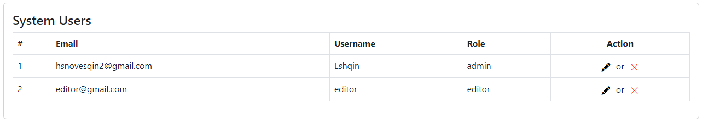

# Tutorials Blog Website
Welcome to the Tutorials Blog Website, a Node.js-based web application that allows admins to create courses and manage user privileges. Users can add courses and their contents. Please follow the instructions below to get started.

# Table of Contents
<ul> 
    <li>Getting Started</li>
        <ul> 
            <li>Prerequisites</li>
            <li>Installation</li>
        </ul>
    <li>Usage</li>
        <ul> 
            <li>Logging In</li>
            <li>Admin Privileges</li>
            <li>Adding Courses</li>
            <li>Adding Course Contents</li>
            <li>User management</li>
        </ul>
</ul>

# Getting Started
## Prerequisites
Make sure you have the following software installed on your system:
<ul> 
    <li>Node.js</li>
    <li>MongoDB</li>
</ul>

## Installation
1. Clone the repository:
```bash
    git clone https://github.com/yourusername/course-management-website.git
    cd course-management-website
```
2. Install dependencies:
```bash
    npm install
```
3. Configure environment variables:
Create a `.env` file in the project root and configure the following variables
(Replace your-session-secret with a secure session secret.):
```bash
    MONGODB_URI={local mongodb URI: "mongodb://localhost:27017/blogDB" or online URI such as AWS}
    SESSION_SECRET=your-session-secret
```
4. Start the application:
```bash
    node app.js
```

# Usage
## Logging In
To access the website, follow these steps:
1. Open your web browser and go to the login page:
```bash
    http://localhost:3000/login
```
2. Start the application:
Enter your credentials (username and password).
3. Enter your credentials (username and password).
If the credentials are correct, you will be redirected to the main page <b>(`http://localhost:3000/`)</b> that contains the list of courses.

## Admin Privileges
Admins have additional privileges to manage users and courses. Regular users can only add or edit tutorials.

* Admins can add users to the system and modify their privileges.
* Regular users can only add or edit tutorials within existing courses.
* Admins can add, edit, and remove courses.

## Adding Courses
<ol>
    <li>If you are an admin, log in to the website.</li>
    <li>Click the "Create Course" button on the main page.</li>
    <li>Fill in the course details, such as the course name, description, and any other relevant information.</li>
    <li>Click the "Create" button to add the course.</li>
</ol>

## Adding Course Contents
<ol>
    <li>If you have access to a course, you can add or edit tutorials within that course.</li>
    <li>Navigate to the course's page by clicking on the course title on the main page.</li>
    <li>Click the "Add Tutorial" button on the course page.</li>
    <li>Fill in the tutorial details, such as the tutorial title, description, and content.</li>
    <li>Click the "Save" button to add or update the tutorial.</li>
</ol>

## User Management
The User Management is a restricted page accessible only to administrators. It provides an overview of users along with their credentials, such as email, username, and privilege. Administrators have the ability to manage user accounts by either editing or deleting them.

### Accessing the User Management page
1. Log in as an administrator to access the User Management Page.

2. Once logged in, navigate to the User Management page by clicking on the "System Users" link in the navigation menu.

On this page, you will see a table containing user information, including email and username. For each user, there are two available actions:

- **Edit**: When an administrator chooses to delete a user from the Admin Dashboard, a confirmation prompt will appear using a SweetAlert dialog. Upon confirming the deletion, the user will be removed from the system, provided that the administrator's session has not expired. After successful deletion, the page will automatically refresh to reflect the updated list of users.

- **Delete**: To edit a user's credentials, administrators can select the "Edit" option next to the user's information on the Admin Dashboard. This action will redirect the administrator to an editing page where they can make changes to the user's details. This approach will be enhanced in the future to provide a more streamlined editing experience. Upon successful editing, a SweetAlert dialog will confirm the changes, and administrators will be redirected back to the Users page. However, if the administrator's session has expired, they will be redirected to the login page.

Below is a screenshot of the Admin Dashboard for reference:



Please exercise caution when making changes to user accounts, as they can have a significant impact on the system.
In this section, I've included details about how to access the User Management page, the actions administrators can perform (Edit and Delete), and a placeholder for the screenshot. You can place this section in the README where it makes the most sense, usually after the sections related to user authentication and permissions.


